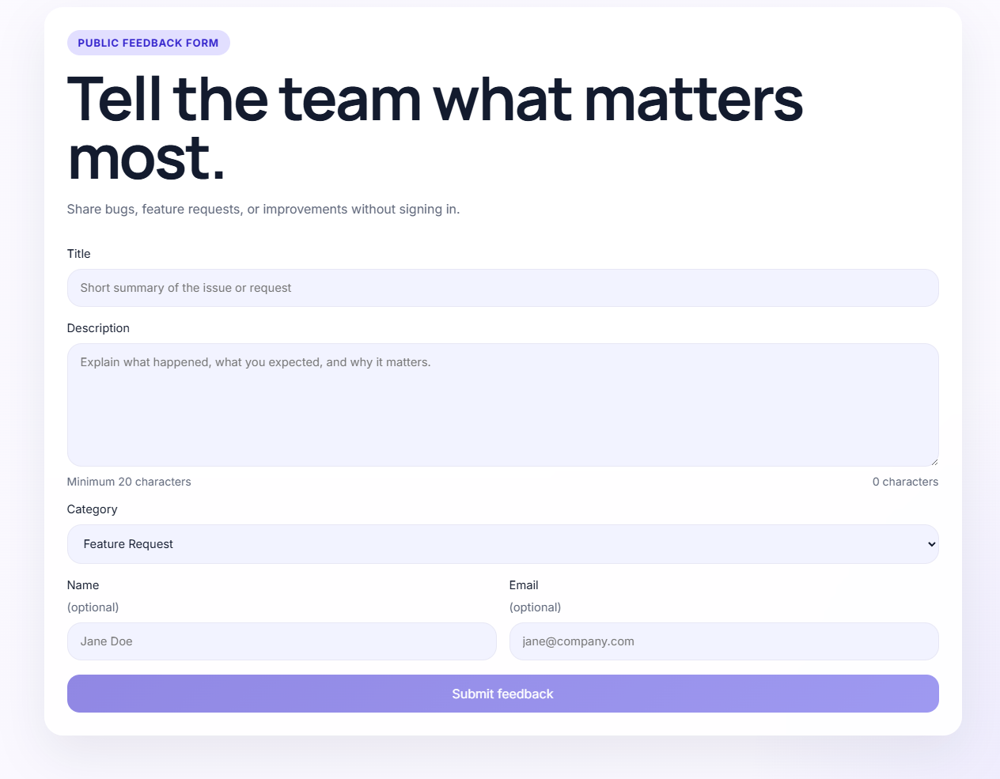
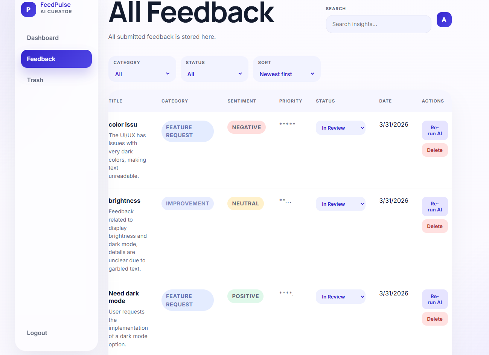

# FeedPulse

FeedPulse is an AI-powered product feedback platform built for the Software Engineer - Product Development Intern assignment. It includes a public feedback submission flow, Gemini-powered feedback analysis, and a protected admin dashboard for triage and review.

## Tech stack

- Frontend: Next.js 14, React, TypeScript, CSS
- Backend: Node.js, Express, TypeScript
- Database: MongoDB with Mongoose
- AI: Google Gemini
- Auth: JWT-based admin session token

## Project structure

```text
feedpulse/
|- frontend/
|- backend/
|- package.json
|- README.md
```

## Features implemented

- Public feedback form with client-side validation and success/error states
- `POST /api/feedback` saves to MongoDB and triggers Gemini analysis
- Gemini fields saved on the feedback document: category, sentiment, priority, summary, tags
- Graceful AI failure handling so feedback still persists
- Manual AI re-run for any feedback from the admin dashboard
- Rate limiting on feedback submission: 5 per IP per hour
- User registration, verification email flow, and login
- Protected dashboard with feedback list, sentiment badges, filters, search, sorting, pagination, stats, trash/restore, and status updates
- Logged-in users can view their own submitted feedback on the homepage
- On-demand 7 day AI summary
- Consistent API response shape: `{ success, data, error, message }`
- Swagger UI for backend testing
- Docker Compose support for one-command startup

## Environment variables

Create `backend/.env`:

```env
PORT=4000
MONGO_URI=mongodb://localhost:27017/feedpulse
JWT_SECRET=change-me
GEMINI_API_KEY=your-gemini-api-key
GEMINI_MODEL=gemini-2.5-flash
GEMINI_FALLBACK_MODEL=gemini-1.5-flash
GEMINI_RETRY_COUNT=2
GEMINI_RETRY_BASE_DELAY_MS=1000
FRONTEND_URL=http://localhost:3000
ADMIN_EMAIL=admin@feedpulse.local
ADMIN_PASSWORD=feedpulse-admin
```

Create `frontend/.env.local`:

```env
NEXT_PUBLIC_API_URL=http://localhost:4000/api
```

## Run locally

1. Install dependencies in the root workspace with `npm install`.
2. Start MongoDB locally, or update `MONGO_URI` to point at your instance.
3. Add the backend and frontend environment files.
4. Run the backend with `npm run dev:backend`.
5. Run the frontend with `npm run dev:frontend`.
6. Open `http://localhost:3000`.

## Run with Docker Compose

1. Create a root `.env` file for Docker Compose:

```env
GEMINI_API_KEY=your-google-ai-studio-key
GEMINI_MODEL=gemini-2.5-flash
JWT_SECRET=change-me
ADMIN_EMAIL=clarishajoseph016@gmail.com
ADMIN_PASSWORD=123456
EMAIL_FROM=
SMTP_HOST=
SMTP_PORT=587
SMTP_USER=
SMTP_PASS=
```

2. Start the full stack:

```bash
docker-compose up --build
```

3. Open the app:

- Frontend: `http://localhost:3000`
- Backend API: `http://localhost:4000`
- Swagger UI: `http://localhost:4000/api/docs`

Notes:
- MongoDB runs in the `mongo` service and persists data in the `mongo_data` volume.
- The backend connects to MongoDB through `mongodb://mongo:27017/feedpulse`.
- The frontend talks to the backend through the Compose service name during build and resolves to `localhost` in the browser automatically.
- A real Google AI Studio Gemini key is required for AI analysis and the `Re-run AI` action to work.
- Gemini requests now retry automatically on transient `429` and `503` provider errors, then fall back to `GEMINI_FALLBACK_MODEL` if configured.
- SMTP values are optional unless you want email verification working inside Docker too.

## Admin login

- Email: `clarishajoseph016@gmail.com`
- Password: `123456`

These can be changed in `backend/.env`.

## API endpoints

- `POST /api/auth/login`
- `POST /api/feedback`
- `GET /api/feedback`
- `GET /api/feedback/:id`
- `PATCH /api/feedback/:id`
- `DELETE /api/feedback/:id`
- `GET /api/feedback/summary`

## Screenshots

Add at least two screenshots here before submission:
### Public submission page



### Admin dashboard


- Public submission page
### Feedback management

- Admin dashboard



## What I would build next

- Move AI processing into a background queue
- Add test coverage with Jest and Supertest
